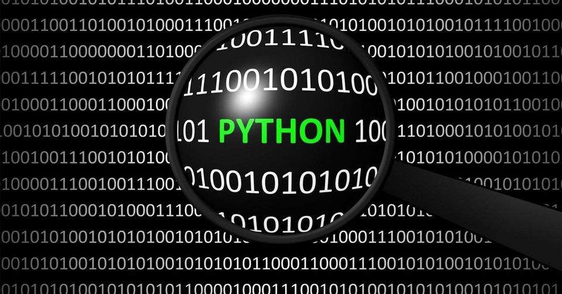

# Mục Lục Các Bài Học:

---
## Phần Chính:
### 1. [Bài 1: Giới thiệu về  Python](tutorial/1.md)
### 2. [Bài 2: Vòng lặp for](tutorial/2.md)
### 3. [Bài 3: Vì sao âm của âm lại là dương](tutorial/3.md)
### 3. [Bài 4: Định lý Pytago](tutorial/3.md)

---
## Phần Mở Rộng:
### 1. [Phân loại văn hóa](extends/plvh.md)
### 2. [Một Dân Tộc Đáng Trách](extends/mdtdt.md)
### 3. [Dạy Trẻ](extends/dt.md)