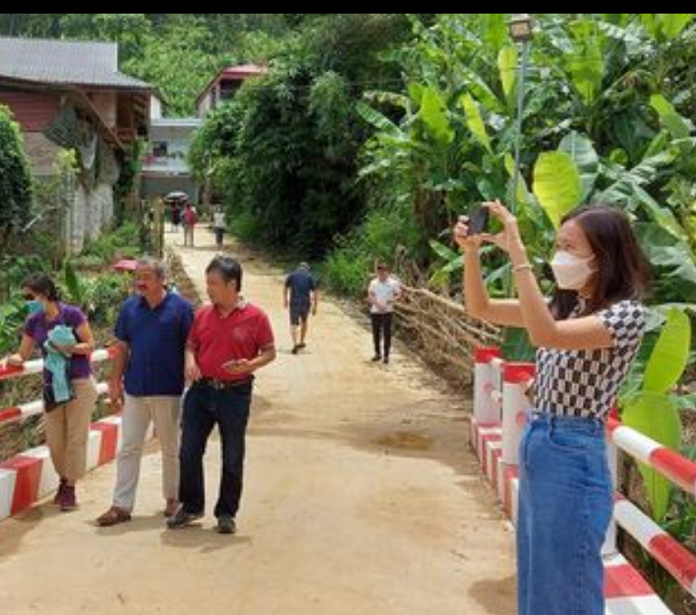

Dạy Trẻ.
---
---
[**Mục Lục**](../README.md)

Chúng ta tiến hành một "lớp" học để dạy trẻ. Tuy nhiên đây không phải là tôi có một bài thuốc tiên, mà khi các bạn uống vào là thành người giỏi. Như thế các bạn không nên hỏi tôi về bài giảng, các bạn sẽ tự viết chúng ra. Cũng không ai phải trả tiền cả.

Sau khi các bạn đã cùng với trẻ có được kỹ năng *"quan sát, giải thích và tổng kết"* chúng ta sẽ nói tiếp tới kỹ năng *"tưởng tượng, quy trình hóa và ghi nhớ"*. Sau đó mới bắt đầu các bài học về `lập trình`. Khi lập trình thì tất cả mọi thứ `"quan sát, giải thích và tổng kết"` & `"tưởng tượng, quy trình hóa và ghi nhớ"` vẫn diễn ra như thường lệ.

Sẽ có một bạn làm hộ trang web cộng đồng, nơi ấy các bậc bố mẹ sẽ cùng trao đổi kinh nghiệm.

Bước đầu là đi dã ngoại, leo núi.

1. **Bố mẹ nên chuẩn bị trước cùng với con:**
   - Mua giày (rộng hơn dày thường đi 1 số), găng tay, balo, áo mưa, quần áo thể thao...
   - Mua đồ nhẹ, và cần phải mua cho trẻ balo để trẻ tự đeo. Trong balo sẽ có những đồ cần thiết nhất.

2. **Bước tiếp theo là lựa chọn cung đường:**

    Bố mẹ phải đi trước và tìm hiểu lịch sử của vùng đất, tính cách con người nơi ấy...

    Mỗi khi đi đến đâu thì giảng giải cho con mình để tập cho chúng cách nhìn nhận xã hội, con người, cảnh quan, văn hóa vùng miền.

    Nếu tìm hiểu được lịch sử vùng quê nơi ấy thì càng tốt. Nên liên kết lịch sử vùng miền vào với lịch sử dân tộc.

    Nếu tìm hiểu được phương thức người dân nơi ấy làm ăn kinh tế thì lại càng tốt.

    Hãy để cho trẻ tự phán đoán ra mức thu nhập bình quân của người dân, để cho chúng nhận xét xem có cách nào làm tốt hơn được không.

3. **Sau đó là vào rừng:**

    Bố mẹ nên tìm hiểu cây cối (tra vào mạng internet) về tên gọi, phạm vi phân bố trên toàn cầu, tính hữu ích, chu kỳ sinh sản,...

    Tra về các loại côn trùng như mối, kiến cùng tập tục sinh hoạt của chúng... Các loại chim, bướm, sâu, giun...

    Nếu leo núi nên dạy cho chúng cách ước lượng chiều cao. Nên dạy chúng cách tìm đường nếu bị lạc.

    Hãy nói về việc người xưa sử dụng hình học để xác định chiều cao ra sao. Hãy nói cho chúng biết cách sử dụng Google để biết được địa hình 3D chiều.

    Hãy nói cho chúng biết vì sao càng lên cao càng mát hơn, quy luật hạ nhiệt độ như thế nào.

    Hãy nói cho chúng hiểu vì sao núi cao thường là nguồn của các con sông. Hãy nói cho chúng biết núi được hình thành thế nào, và tuổi của nó là gì....

4. **Nói cho trẻ hiểu về lịch sử xuất hiện toán học và nguyên nhân dẫn đến thắng lợi của các cuộc chiến.**

5. **Hãy mua máy đo oxy, nhịp tim, huyết áp để trẻ thực tập cho trẻ các thao tác về y học:**

    Hãy giải thích cho chúng các chỉ số sinh tồn là gì, và làm sao để duy trì được sức khỏe.

    Hãy nói cho trẻ biết quá trình leo núi thì cơ thể có thấy mệt không, vì sao. Hướng dẫn cho trẻ cách tính số lần thở và nhịp tim, qua đó tính lượng oxy đã trao đổi.

    Hướng dẫn cho trẻ biết lượng mỡ dư thừa (mức giảm cân) đã đốt tương đương với lượng oxy có được khi hít thở.

6. **Mỗi lần đi về thì trẻ phải hoàn thành một bài tổng kết (trẻ nhỏ thì bố mẹ viết hộ):**

   Điều quan trọng ở đây là phải để cho trẻ tự lên kế hoạch, tự thực hiện và tự tổng kết.

[Một Dân Tộc Đáng Trách](mdtdt.md)

[Hoàng Hôn Hay Bình Minh.](hhhbm.md)