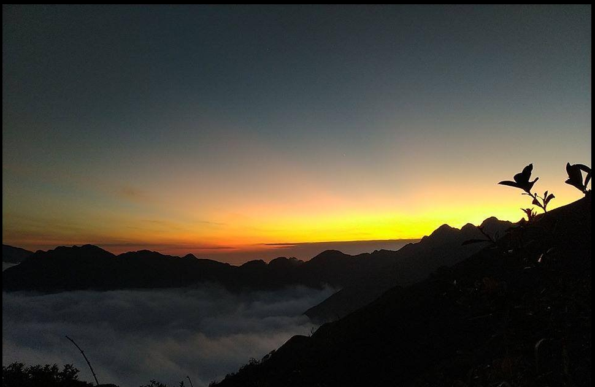
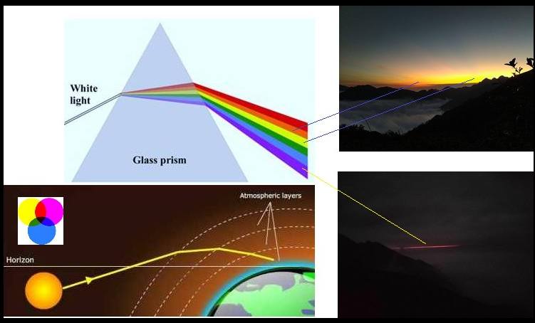
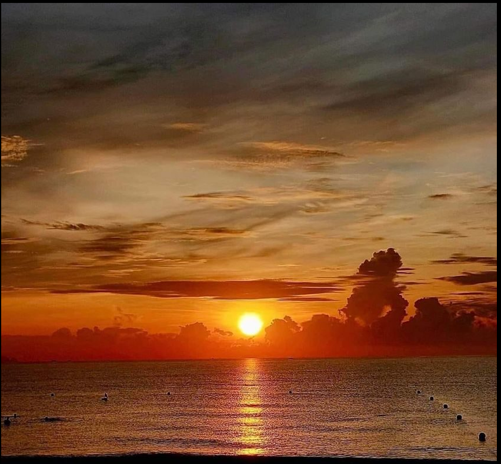
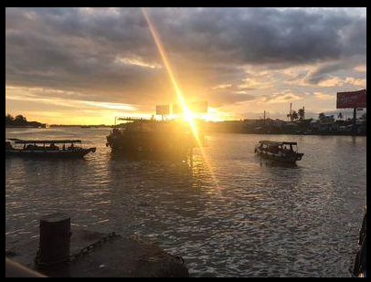

Hoàng Hôn Hay Bình Minh.
---
---
[**Mục Lục**](../README.md)

Hầu hết mọi người đều cho bức ảnh dưới đây là Bình Minh.


Điều này thì cũng chả sai nhiều lắm, mặc dù nó chính là bức ảnh Hoàng Hôn mà tôi chụp khi ở độ cao 2600m.

Không sai nhiều lắm là bởi vì Hoàng Hôn hay Bình Minh thì cũng như nhau, ý muốn nói là độ cao của mặt trời. Quả thật là nếu chỉ dựa vào một bức ảnh mà đoán nhận ra nó được chụp vào lúc  bình minh hay hoàng hôn là rất khó.

## **Vì sao lại khó?**

Trước hết chúng ta có một tí lý thuyết về ánh sáng. Ở đây chỉ nói về phương diện hội họa, cảm nhận màu sắc, hoàn toàn không thi thố hiểu biết (nhắc lại như con vẹt) về các loại Einstein này nọ.

Hiện tượng nhìn thấy các tia sáng trước khi mặt trời mọc và sau khi mặt trời lặn được gọi là hiện tượng `khúc xạ`. Hiện tượng khúc xạ được `Ptolemy` tìm ra vào đầu Công Nguyên, tuy nhiên khả năng toán học khi ấy không cho phép ông đưa ra được công thức cho phép tính toán chính xác.

Phải 1500 năm sau `Snell` mới đưa ra được công thức toán học cho phép tính toán được chính xác góc khúc xạ. Theo đó, khi một tia sáng đi từ vùng này vào vùng kia, thì tỷ lệ của Sin góc tới chia cho Sin góc ra bằng với tỷ lệ của tỷ lệ hệ số chiết suất của môi hai trường.

Định luật `Snell` chính là nguyên lý `Fermat` về chuyển động của ánh sáng, theo đó ánh sáng đi từ điểm này tới điểm kia với thời gian ít nhất có thể. Trong cơ học `Eistein` thì đó là nguyên lý *"Con tàu sẽ chuyển động theo quỹ đạo để tối thiểu hóa thời gian chuyển động của chiếc đồng hồ đặt trên con tàu."*

---
Tiện thể chúng ta cũng nói luôn, định luật vạn vật hấp dẫn của Newton *"mọi vật đều chuyển động dưới tác dụng của lực hút lẫn nhau theo quy tắc `F=-ma`"* thì tương đương với nguyên lý *"Tác động tối thiểu"*.

Nguyên lý nói rằng "*tổng tất cả năng lượng chuyển từ trạng thái động năng sang thế năng và ngược lại là ít nhất có thể"*.

Chẳng biết mỗi khi chuyển trạng thái năng lượng giữa động năng với thế năng cho nhau, Ông Trời có phải làm gì nhiều không, chứ nguyên lý tác động tối thiểu nói đúng cái bản chất *"Thằng cha vận hành vạn vật, tức Ông Trời, lười biếng tới mức chỉ chịu động chân động cẳng ít nhất có thể!"*

---
Vào năm 1667, Isaac Newton đã sử dụng lăng kính để phân tích ánh sáng Mặt Trời thành các tia ánh sáng màu, qua đấy chứng minh được ánh sáng trắng của Mặt Trời là tổ hợp của các ánh sáng có màu.



Chính bầu khí quyển của chúng ta là một chiếc lăng kính khổng lồ và chính bầu khí quyển đã khúc xạ ánh sáng để chúng ta thấy được Mặt Trời trước khi nó mọc lên và sau khi nó lặn xuống.

Và cũng chính nhờ chiếc lăng kính, bầu khí quyển, này mà các tia sáng đầu tiên chúng thấy được trước khi Mặt Trời mọc là các tia sáng màu tím.

Tuy nhiên do tính đối xứng về vị trí của mặt trời mà các tia sáng cuối cùng chúng ta nhìn thấy được khi mặt trời đã lặn cũng sẽ là các tia sáng có màu tím.

Nếu chỉ dừng lại ở một thời điểm, thì sự khác biệt Hoàng Hôn và Bình Minh sẽ không thể nhận ra, nếu chúng ta không có được sự tiêu chí nói lên sự khác biệt giữa Hoàng Hôn và Bình Minh.

Rõ ràng Hoàng Hôn là nói tới khi mặt trời đã chiếu ánh nắng xuống mặt đất. Mặt đất nóng đã khiến cho khối không khí gần mặt đất bốc lên cao. Như vậy sự khác nhau giữa Hoàng Hôn và Bình Minh nằm ở sự khác biệt của tầng khí quyền ở trên cao.

Hoàng hôn là lúc tầng khí quyển ở trên cao đậm đặc hơi nước hơn, các tia sáng mặt trời bị khuyếch tán mạnh khiến cho vệt ánh sáng màu tím cuối cùng trong ngày bị phát tán. Bầu trời có thể thấy màu hơi tím nhưng không thấy các tia sáng màu tím.

Vậy nếu chúng ta thấy các tia sáng màu tím thì tức đó là Bình Minh, lúc rất rất sớm, vào khoảng 3 giờ sáng. Và nếu chúng ta mà có thấy một vệt màu tím sáng rực thì đó cũng là ảnh chụp vào lúc 3 giờ sáng ở độ cao trên 2.5km.

Ở mặt đất, do có lớp khí có hơi nước là là mặt đất khuyếch tán mà chúng ta không thấy một vệt màu tím sắc nét mà thấy một áng màu tím. Ánh màu tím này cũng chỉ tồn tại chừng 10 phút.

---
Vấn đề nhìn ảnh đoán Hoàng Hôn hay Bình Minh hóa ra phức tạp hơn nhiều. Số là thế này. Sở dĩ các tia sáng có màu khác nhau là do chúng có bước sóng khác nhau.

Bước sóng là một thứ biến đổi liên tục, và cái lăng kính Newton là tách ánh sáng theo cái bước sóng ấy. Trong lĩnh vực hội họa thì các màu của bức ảnh là sự cảm nhận, không phải là từ bước sóng. Người ta chỉ dùng có 3 màu cơ bản để tạo ra mọi thứ màu khác nhau.

Hơn thế nữa người ta chú trọng hiệu ứng ánh sáng tác động lên tâm trạng con người nên thường khuyếch đại một số màu nào đó, vì thế mà trong tất cả các bức ảnh chụp bằng điện thoại thì cái màu tím gần như chả còn.

Vậy thì dựa vào cái gì để chúng ta có thể biết được một bức ảnh chụp mặt trời là Hoàng Hôn nay Bình Minh.


---
Do khối không khí bị chiếu sáng ban ngày bốc lên cao mà ánh sáng mặt trời về chiều bị khúc xạ và hấp thụ ở trên cao. Điều này khiến cho bầu trời chiều có màu sáng vàng hơi đỏ (vàng + đỏ + sáng).

Buổi sáng thì khối không khí chưa có nên bầu trời trong hơn và có màu xanh thẫm (tím + xanh + tối). Các màu này thể hiện ở trên các bức ảnh chụp.



Nếu hiệu ứng quầng sáng của mặt trời như nhau thì, buổi chiều quầng sáng là do khối không khí nóng bốc lên cao khúc xạ tạo ra, buổi sáng là mặt trời thật. Quầng sáng mà như nhau, thì về buổi chiều mặt trời đã "lặn" đi xa lắm rồi. Như thế nếu vầng sáng như nhau thì mặt đất mà sáng hơn tức là buổi sáng, và tối hơn thì là buổi chiều.

---
Màu sắc của cây cối tạo ra không hẳn để cho đẹp mà bởi chúng cần các tia sáng có màu thích hợp để tổng hợp ra các chất cần cho sự sống của chúng và cho tất cả mọi loài sinh vật trên trái đất, trong đó có chúng ta.

Màu sắc của hoa lá chúng ta nhìn thấy được là bởi các màu khác đã bị chúng hấp thụ mất đi rồi. Do ánh sáng mặt trời là tổ hợp của các ánh sáng màu, vì thế màu của hoa lá là màu của các bước sóng của ánh sáng mặt trời chưa bị hấp thụ.

Về chiều các tia sáng màu tím không còn chiếu xuống mặt đất, thì khi ấy mọi vật có màu tím vào lúc ban ngày, sẽ có màu đen. *"Chiều dần buông tím cả núi đồi là không có".*

## `Chiều hành quân`
```
Qua những đồi hoa sim
Những đồi hoa sim
những đồi hoa sim dài trong chiều không hết
Màu tím hoa sim
tím chiều hoang biền biệt
Có ai ví như từ chiều ca dao nào xưa xa
Áo anh sứt chỉ đường tà
Vợ anh chưa có mẹ già chưa khâu
Ai hỏi vô tình hay ác ý với nhau
Chiều hoang tím có chiều hoang biết
Chiều hoang tím tím thêm màu da diết
Nhìn áo rách vai
Tôi hát trong màu hoa
Áo anh sứt chỉ đường tà
Vợ anh mất sớm, mẹ già chưa khâu...
Màu tím hoa sim, tím tình trang lệ rớm
Tím tình ơi lệ ứa
Ráng vàng ma và sừng rúc điệu quân hành
Vang vọng chập chờn theo bóng những binh đoàn
Biền biệt hành binh vào thăm thẳm chiều hoang màu tím
Tôi ví vọng về đâu
Tôi với vọng về đâu
Áo anh nát chỉ dù lâu...
1949
```

Phần đầu của bài thơ nói đến màu tím của sự bắt đầu một cuộc đời.
...

```
Ngày xưa nàng yêu hoa sim tím
áo nàng màu tím hoa sim
Tuy nhiên về chiều thì các tia sáng màu tím đã không còn, vậy nên màu tím của hoa sim
....
Màu tím hoa sim
tím chiều hoang biền biệt
là màu đen các em à!!.
```
Dòng sông sẽ chỉ còn khi nó còn chưa đổ vào biển. Cửa sông là chỗ cuối cùng của sông, người ta gọi nó là Chung Thủy.

Chung `終`(cuối) là sự kết thúc, và Thủy là dòng nước `水` (dòng). Màu tím hoa Sim được cho là biểu tượng của sự chung thủy là như vậy.

[Dạy Trẻ](dt.md)