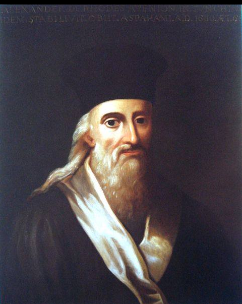
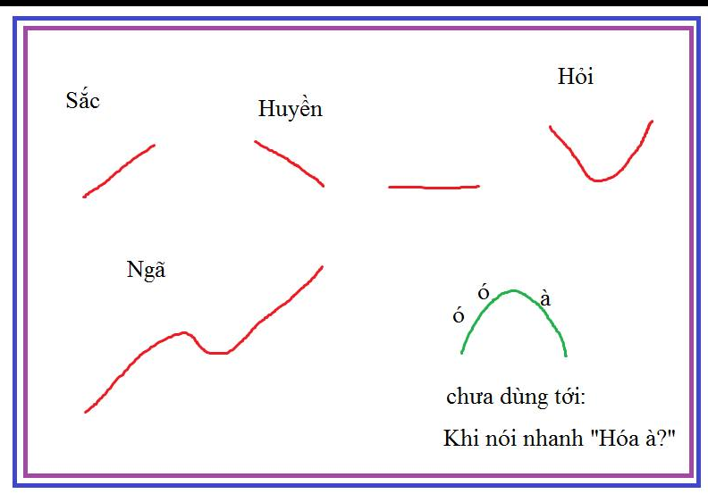
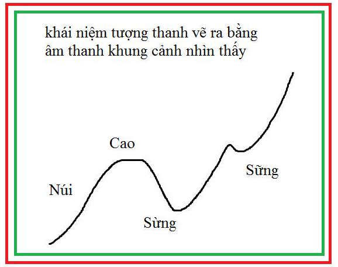

Một Dân Tộc Đáng Trách (7:00 ngày 7/7/2018).
---
---
[**Mục Lục**](../README.md)

Tự thân việc truy tìm "Cha Đẻ" của "chữ Quốc Ngữ", tức việc Latinh hóa Tiếng Việt cũng không có gì đáng giá mà phải thần thánh hóa.

Sự thật Latinh hóa một ngôn ngữ không thể là việc làm của một ngày, càng chả thể của một người. Đối với tiếng Việt lại càng khó hơn. Hơn thế nữa chúng ta cũng chả còn hiểu cái ông Alexandre de Rhodes thì khác ông Francisco de Pina ở chỗ nào.



Họ chỉ còn là những cái tên. Họ là các vị thánh mà dân tộc chúng ta phải biết ơn. Nhờ việc Latinh hóa tiếng Việt thành công, mà khả năng đồng hóa của ngôn ngữ tiếng Việt của chúng ta gần như mạnh nhất thế giới.

---
Tiếng Việt của chúng ta lấy của tiếng Thái, tiếng Hán, tiếng Pháp, tiếng Anh... rất nhiều, và tự nhiên đến mức chả có ai để ý những từ mới với các khái niệm ấy từ đâu mà ra.

Khả năng đồng hóa của tiếng Việt bảo đảm cho sự trường tồn của văn hóa Việt.

Tiếng Việt có từ rất lâu đời. Trước hết là hệ thống âm thanh và ngữ pháp cùng từ vựng. Ông ngoại tôi có bảo với mẹ tôi và cậu tôi là tiếng Việt có chữ viết riêng. Mẫu chữ ấy có lưu trong thư viện của ông, nhưng cán bộ cải cách rộng đất tới đốt hết cả đi rồi. Ông của tôi cũng bị xử tử, mặc dù nuôi và che giấu cả đống cán bộ cấp cao.

Tôi không tìm thấy một luận điểm khách quan nào để ủng hộ ông nên tôi không thật sự để tâm tới thông tin về chữ viết ấy.

Tôi cũng có đọc các công trình về dấu thanh tiếng Việt và Latinh hóa tiếng Việt của các nhà ngôn ngữ Việt Nam, nhưng tôi thấy họ quá ngây ngô. Sự đần độn của tất cả họ được thể hiện ở việc hầu như tất cả người Việt Nam chả ai biết tiếng Việt chúng ta có bao nhiêu chữ cái.

---
Thế nào là Latinh hóa tiếng Việt? Việc làm này gần như các cha Alexandre de Rhodes và Francisco de Pina mang nặng đẻ đau ra sao thì dân tộc ta được hưởng như vậy.

Nếu không vì sự trung thực trước Chúa mà các cha lược bỏ đi những đặc tính quý báu của tiếng Việt, thì nay chúng ta cũng chỉ còn biết kêu Trời. Một trong số các đặc điểm đó là tiếng Việt không thể hoàn toàn Latinh hóa. Tiếng Việt không Latinh hóa hoàn toàn được bởi nó có dấu thanh.

Rất nhiều người không hiểu được thế nào là Latinh hóa. Âm thanh tiếng nói của người được hình thành do không khí nén phát ra từ phổi qua một cái khe hẹp, được gọi là thanh quản. Nó cũng giống như cái còi. Các âm thanh này đơn điệu chỉ khác nhau to nhỏ còn lúc nào cũng tu tu tu.

Nếu các bạn nhét vào trong còi một hòn sỏi, âm thanh của nó sẽ trở nên rất phức tạp loắng loắng: "toe, tòe roét toét...". Sự nhiễu loạn âm thanh này là do hòn sỏi chuyển động mà ra. Tai chúng ta nghe được sự khác biệt này, và như các bạn thấy là chúng không nhàm chán.

Cơ chế tạo âm thanh tiếng nói cũng giống như vậy, nó được "sỏi" hóa. Các âm đi từ thanh quản ra bị sự chuyển động của lưỡi miệng làm cho méo đi.

---
Hòn sỏi ở đây chính là hệ thống lưỡi miệng. Miệng của chúng ta có thể hạ xuống và đưa ra phía trước, lưỡi của chúng ta làm cho các chuyển động lên xuống này trở nên tinh xảo hơn.

Dựa vào âm nghe được mà chúng ta biết được vị trí của lưỡi miệng. Việc ghi lại theo thời gian vị trí của hệ thống lưỡi miệng được gọi là quá trình La tinh hóa, hay đó chính là quá trình số hóa âm thanh tiếng nói. So với tiếng Hán, tiếng Việt của chúng ta là một ngôn ngữ đã được số hóa.

Định nghĩa Latinh hóa (hay số hóa tiếng Việt):
```
"Latinh hóa hay số hóa, là việc ghi lại vị trí của hệ thống lưỡi miệng theo thời gian. Tại mỗi vị trí được ký hiệu bằng một chữ cái và đó là chữ cái Latinh của ngôn ngữ."
```

---
Tiếng Việt không phải có 26 chữ cái ABC các bạn nhé. Tự các bạn đếm ra và đăng ký mà bảo vệ tiến sĩ Việt Nam.

Các chữ cái được xếp lại theo trình tự thời gian. Dấu thanh là thứ tác động trên toàn bộ âm phát ra. Và như vậy nó không thể là một chữ cái.

Đó là điều mà dân tộc Việt Nam chúng ta phải biết ơn các Alexandre de Rhodes và Francisco de Pina đã giữ lại đặc điểm vô cùng quý báu này của tiếng Việt. Ơn Chúa đã đẩy sự trung thực vào công việc của các cha Alexandre de Rhodes và Francisco de Pina.

Ấy vậy nhưng dấu thanh tiếng Việt có một đặc điểm mà nhờ vào đặc điểm này mà tiếng Việt của chúng ta trở nên thần thánh, khả năng đồng hóa rất mạnh.

Đặc điểm đó là: *"dấu thanh của tiếng Việt trên thưc tế lại là một chữ cái!"* -- Hiểu theo nghĩa *"âm + thanh"* khác nhau thì nghĩa khác nhau. Lượng âm thanh dự trữ chưa có nghĩa là rất rất lớn.

---
Chúng ta sẽ nói rõ điều này. Khi nói tới dấu thanh của tiếng Việt, hầu như các nhà ngôn ngữ Việt Nam đưa ra khẳng định tiếng Việt có 8 thanh điệu. Ấy nếu hỏi thế thanh điệu là gì thì chả có định nghĩa.

Trước hết chúng ta định nghĩa dấu thanh. Định nghĩa này do tôi đưa ra vào những năm 1990 khi nghiên cứu về âm thanh.

Định nghĩa dấu thanh tiếng Việt:
```
"Dấu thanh tiếng Việt là sự thay đổi tần số trong một âm phát ra".
```

*Nếu tần số tăng tức đó là dấu sắc, nếu tần số giảm đó là dấu huyền, nếu tần số không thay đổi tức là không có dấu.*

Sự thay đổi này chỉ diễn ra trong một âm tiết, tức khoảng 1/4 giây.

Ngày nay có thể sử dụng các trình phân tích dấu thanh có sẵn trên mạng để vẽ đồ thị dấu thanh. Vào thế kỷ 16 chưa có khái niệm về phân tích phổ Fourier mà các cha cố dòng Tên nhận ra sự khác biệt ấy là rất tài giỏi.



---
Xét về khả năng trong khoảng 1/4 giây thì đồ thị biến thiên tần số âm thanh tiếng nói chỉ có thể có không quá 1 cực đại và 1 cực tiểu.

Và tiếng Việt của chúng ta có đầy đủ mọi khả năng biến thiên ấy.
```
dấu sắc:  đạo hàm +++  (tần số tăng)
dầu huyền: đạo hàm --- (tần sô giảm)
không dấu : đạo hàm 000
Dấu hỏi:   đạo hàm ---+++     (cực tiểu)
Dẫu ngã : đạo hàm ++--++ (điểm uốn)
```

---
Chúng ta có thể phát âm dấu thanh như sau:
```
sáo    s...ááó
sào    s...ààò
sảo    s....ààó
são    s...áàó
```

Có một thanh nữa chưa có ký thanh. Dấu thanh này đồ thị tần số có cực đại (do Nguyễn Lê Anh):
```
        s... ááò
```
Các bạn phát âm thật nhanh cụm "táo à" như 1 âm.

Ngoài ra có dạng ngắn của âm thanh như "sạ" và "sat" (âm phát ra 1/16 giây)

Từ định nghĩa trên chúng ta có thể thống kê được tất cả có bao nhiêu dấu thanh.

Hiện tượng *"dấu thanh tiếng Việt mang tính chữ cái"* là bởi nghĩa của âm phát ra là phụ thuộc cả vào dấu thanh và vị trí của hệ thống lưỡi họng.

Tiếng Việt sử dụng dấu thanh để truyền nghĩa. Các âm như *"Ba, Bà, Bạ..."* là khác nhau. Tôi không rõ lắm liệu trên thế giới còn có ngôn ngữ nào như vậy nữa hay không.

(Dấu thanh trong tiếng Trung không gắn với âm. Nó biến thiên, vì thế âm thanh có dấu khác nhau vẫn có thể có cùng nghĩa. Ngoài ra không đủ mọi khả năng biến thiên --  Ví dụ `Ủa` và `Úa` đều là `我` (đứng trước âm nào thì biến đổi theo âm ấy). Tiếng Việt thì `úa` và `ủa` khác xa nhau.).

Trong kho ngữ vựng thuần Việt, các từ có âm sắc thường mang nội dung cảnh báo sự nguy hiểm, các từ có âm huyền thì không.

Trẻ nhỏ rất nhạy cảm trước dấu thanh của âm thanh truyền đạt, chúng cảm nhận được "nội dung" trước khi biết nghĩa của các câu nói.

Ngoài ra có một đặc tính rất hay là cụm từ. Tần số của các âm trong cụm từ mà tạo ra sự gián đoạn, ví dụ *"thắc mắc"* (tần số không thể lên cao mãi được) thì âm ấy khó đọc hơn và mang ý thận trọng hơn.
Nó ngược với các cụm từ mà tần số âm thanh liên tục ví dụ như *"thanh bình".*



Các đặc điểm của tiếng Việt: (sẽ viết)
1. Tượng thanh (tần số âm thanh vẽ ra khung cảnh nhìn thấy, nghe thấy)
2. Tượng nghĩa (thừa hưởng của tiếng Hán)
3.  Ký thanh (La tinh hóa)
4. Dự trữ âm vựng (dùng để ký mã nghĩa mới và đồng hóa ngôn ngữ khác)
5. Cấu trúc nghĩa vựng và Quack hóa nghĩa vựng.
...

---

- Dấu thanh không phải chữ cái vi nó tác động lên toàn con chữ
- Bảng các chữ cái tiếng Việt.
- Ngữ pháp tiếng Việt: dạng bổ kết quả, giao thoa trường ngữ nghĩa và ảnh hưởng tới chức năng ngữ pháp

Những cái trên tôi sẽ viết ...
Thay vì đi làm những việc nhảm nhí tìm xem ông *"râu dài tới đâu là bố đẻ"*, nên thể hiện sự biết ơn dưới dạng tiếp nối công sức của họ..

[Phân loại văn hóa](extends/plvh.md)

[Dạy Trẻ](extends/dt.md)