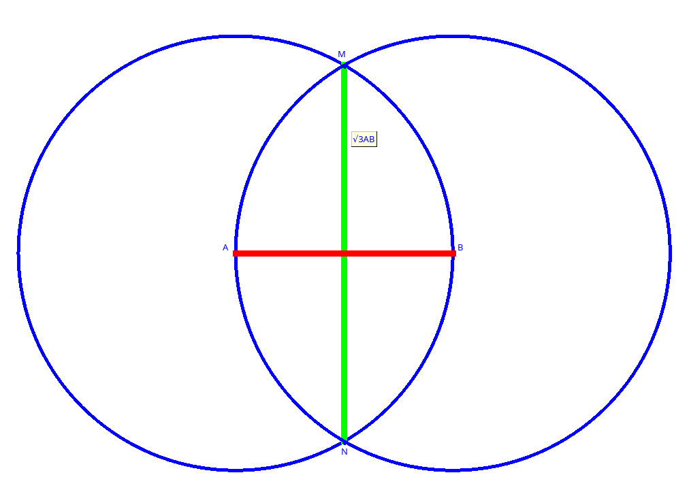
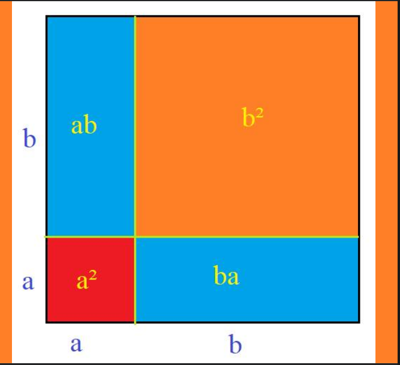

Phân loại văn hóa.
---
---
[**Mục Lục**](../README.md)

Tôi đã nghiên cứu về văn hóa từ hơn 10 năm nay. Lúc đầu thì tôi nghiên cứu về văn hóa doanh nghiệp. Ngày ấy, do nhu cầu đi dạy kiếm tiền mà tôi phải nghiên cứu.

Tôi chợt nhận ra, ai cũng nói về văn hóa mà chả mấy ai hiểu đúng khái niệm văn hóa là gì. Người ta đã đưa ra gần 300 định nghĩa về văn hóa để rồi cũng chẳng hiểu được nó là thứ gì.

Tôi âm thầm đi tìm hiểu về văn hóa.

---
Tôi rất thích Newton, với tôi ông ấy là một ông thánh, chính ông ấy đã giải thoát cho loài người khỏi nỗi sợ hãi của các loại siêu nhiên.

Tôi yêu triết lý của cơ học Newton. Cơ học Newton là sự lý giải về lực và vai trò của lực. Và rồi đến một lúc tôi chợt nhận ra, cơ học Newton không thể tồn tại được khi không có khái niệm về con số, về không gian.

Tôi dần hiểu cơ học Newton là sự tiếp tục lối tư duy của hình học Euclid. Và tôi đi tìm hiểu về hình học Euclid. Tôi đã hiểu ra cái nguyên nhân cơ bản mà các bậc vĩ nhân 500 năm trước Công Nguyên đã tạo ra hình học Euclid.

---
Hóa ra cái nhu cầu ấy nằm ở chỗ, cần phải thông báo cho nhau về giá trị của một con số. Mỗi con số được coi là độ dài của một đoạn thẳng so với đoạn thẳng đơn vị.

Họ bắt đầu từ đoạn thẳng đơn vị và cái con số cần thông báo được mô tả thông qua quá trình dựng hình.

Lấy ví dụ như đoạn thẳng đơn vị là AB. Lấy A và B làm tâm vẽ vòng tròn bán kính đơn vị. Hai vòng tròn này cắt nhau tại điểm M và N.

Đoạn thẳng MN chính là √3 (so với đoạn thẳng AB). Các vĩ nhân của loài người đã đưa ra hệ thống các quy tắc dựng hình, kiểu như *"từ một điểm ngoài một đường thẳng ta chỉ có thể kẻ được duy nhất một đường thẳng không cắt đường thẳng đã cho".*



Tập hợp các nguyên lý cơ bản ấy được các vĩ nhân của nhân loại tổng hợp lại dưới dạng **hệ tiên đề Euclid**. Họ dùng hệ tiên đề Euclid để xây dựng ra hình học Euclid, xây dựng ra công cụ biểu diễn các con số.

Hóa ra hệ thống thập phân về con số, kiểu như `2022` hay `3.14`, là mới xuất hiện. Trước đó người ta dùng **`chữ số La Mã`**.. Chính người Ả Rập đã tiếp nhận kiến thức hình học Eulid về các con số được biểu diễn qua đoạn thẳng, nhưng thay vì phải dựng hình, họ đã lọc ra các quy tắc để áp dụng cho các con số đoạn thẳng, và họ gọi phương áp ấy là **`Đại Số.`**

Như thế, các đoạn thẳng (con số) được họ ký hiệu là `a`, là `b`... Và họ có các "hằng đẳng thức" kiểu như `(a+b)²=a²+b²+2ab`.



Họ đưa ra một hệ thống các quy tắc biến đổi cơ bản mà họ gọi là `hệ tiên đề số thực`.

Thật sự tuyệt vời, những người Ả Rập đã chuyển thể `hệ tiên đề hình học Euclid` sang `hệ tiên đề số thực`.

---
Thế rồi tới một lúc tôi muốn đi tìm hiểu, lối tư duy nào đã tạo ra các vĩ nhân Newton, Euclid? Họ đã suy nghĩ như thế nào? Tôi có thể là họ không nếu tôi sinh ra vào thời của họ.

Rõ ràng là các bậc vĩ nhân đều xây dựng được các khái niệm mà trước đó chưa hề có. Họ nói về lực, họ nói về các con số.

---
Tôi đi ngược lại lịch sử văn minh của loài người thì nhận thấy, văn minh của loài người xuất hiện khi có một xã hội đủ đông. Đó là thời kỳ chiếm hữu nô lệ. Giới chủ nô đã nhận ra là nô lệ cần phải được giáo dục cho biết sợ hãi để biến họ thành một công cụ lao động.

Một vĩ nhân "Adam" nào đó trong giới chủ nô đã sử dụng phương pháp tiên đề để xây dựng khái niệm về Chúa và quyền lực siêu nhiên. Toàn bộ hệ thống kinh thánh hay kinh Bụt là nằm xây dựng ra các khái niệm siêu nhiên ấy.

Cái này thì giống hệt như việc Euclid sử dụng hệ tiên đề để xây dựng ra công cụ biểu diễn số, và cũng giống hệt như Newton sử dụng hệ tiên đề cơ học Newton để xây dựng ra lực và các quy luật vận động của vạn vật trong vũ trụ.

Nói một cách đúng hơn thì phải ngược lại. Chính Euclid và Newton là học trò xuất sắt của vị đại vĩ nhân "Adam" nói trên.

Tôi quan niệm văn hóa na ná như hệ thống lực và các định luật trong cơ học Newton, dùng để vận động một nhóm nào đó con người. Tôi tìm cách mô tả văn hóa theo lối tiên đề như các bậc tiền bối đã làm. Tôi cảm thấy rất thú vị với những gì đã tìm ra được.

Những khám phá ấy giúp tôi có được cái nhìn khách quan về xã hội loài người, về lịch sử phát triển của chúng. Và hơn hết nó đã giúp tôi có được hiểu biết về ý nghĩa của cuộc sống. Tôi biết văn hóa có sức mạnh ghê gớm và đã sử dụng nó để phục dựng lại lịch sử dân tộc.

Các quy luật cơ bản để thúc đẩy sự phát triển của một cộng đồng được phân vào hai định dạng, định dạng thứ nhất là **các quy luật liên quan tới sự sống còn ăn uống**, định dạng thứ hai liên quan tới **sự tồn tại sinh sôi**.

Tôi thật sự ngạc nhiên khi văn hóa của các dân tộc có thể phân loại theo cách thức mà họ đối xử với nhau về *miếng ăn*, về *sinh đẻ*.

Về sinh đẻ tức là quan hệ giới tính, kiểu như mẫu hệ hay phụ hệ, cách thức dựng vợ gả chồng, vai trò của phụ nữ trong gia đình và trong xã hội...

Anh Hồng Trường vừa gửi cho tôi đoạn văn dịch sau:

Đoạn văn dưới đc dịch từ Lĩnh Ngoại đại đáp của Chu Khứ Phi đời Tống (cái đây 700 năm), - vô tình hay kinh nghiệm - tác giả lấy mô tả phẩm chất của Nữ để người đọc suy diễn nền tảng xã hội.

Bởi chỉ có số liệu thống kê cho thấy tỷ lệ ly hôn ở VN tăng dần theo thời gian (hiện khoảng trên 30%) nếu tính ly thân con số khoảng 58% mà ko có tài liệu ng/cứu cơ bản về xu hướng, biến đổi đối với công việc, hoạt động, biến đổi tâm lý về giới trong quá trình Âu hoá ko lựa chọn ở VN, nên lấy hình chụp như là 1 hình thức 'đấu tranh' cho nữ quyền (quyền bình đẳng nam-nữ) trong thời hiện đại.

Mức độ đổ vỡ gia đình ở VN sẽ đạt ngưỡng cao nhất so của phương Tây trong tương lai gần. Một loạt vấn đề về an sinh xã hội, chăm sóc người già, bệnh tâm lý cô đơn người cao tuổi, ngược đãi người già, tổn thương tâm lý trẻ con dẫn đến biến đổi cá nhân của thế hệ trẻ.
```
“...An Nam là xứ nóng, hình như không hợp với nam giới, nhưng đặc biệt hợp với phái nữ. Mặt trời cứ chiếu sáng hừng hực thế thì tất có hại, nhưng tất nhiên cái gì cũng có 2 mặt lợi hại tương ứng. Tôi đã quan sát rất kỹ con gái [An Nam], thấy hình như xứ này con gái nồng nàn hơn! Con trai [An Nam] thân hình nhỏ hơn [con gái], nhan sắc cũng kém hơn; những cô gái đã có chồng thường búi tóc gọn, cơ thể đẫy đà hơn, rồi chân tay cũng đen, nhưng người tròn lẳn, nghe nói nếu có 1 đứa con thì người nữ rất đẹp? lại cũng ít bệnh thừa sức. Từ thành thị đến khắp nơi, phụ nữ An Nam thường hay đi buôn bán nhỏ kiếm lời. Đàn ông đi buôn hay đi làm ăn xa, cũng đem theo vợ. Tôi rất khâm phục phụ nữ An Nam, dù cho một người đàn ông có thể lấy nhiều vợ, nhưng phụ nữ khá ham làm, các bà vợ đều tự đi buôn hay dựa vào các trục đường lớn ở phố chợ kiếm sống, được tiền về lại đưa cho chồng. Khi lấy chồng rồi thì người phụ nữ thường được gọi theo tên chồng, gọi tên mình thì không trả lời nữa? Có những ông chồng, hết ngày là ôm gối đi chơi, không đem theo con cái nhưng giấu tiền vào tay áo [đi đánh bạc]. Thường thì khi con cái đã lấy chồng lấy vợ, bố mẹ sẽ làm cho 1 ngôi nhà lợp bằng cỏ tranh cho ở riêng. Tình nghĩa vợ chồng cũng khá gắn bó [không như TQ]...”
 ```

Ngày nay văn hóa xã hội được đặc trưng bởi lừa đảo trộm cướp.

Tôi cũng vừa đọc thấy hình như có tít báo đưa "*Có một Hoa Hậu nào đó được hay bị, con một Đại Gia nào đó xin cưới*".

Hóa ra gái đẹp Việt thì cứ phải làm vợ đạo diễn hay diễn viên Majorca mới phù hợp. Không có vài cầu thủ bóng đá thì khéo mà gái đẹp đứng đường hết cả lũ.

[Một Dân Tộc Đáng Trách](extends/mdtdt.md)