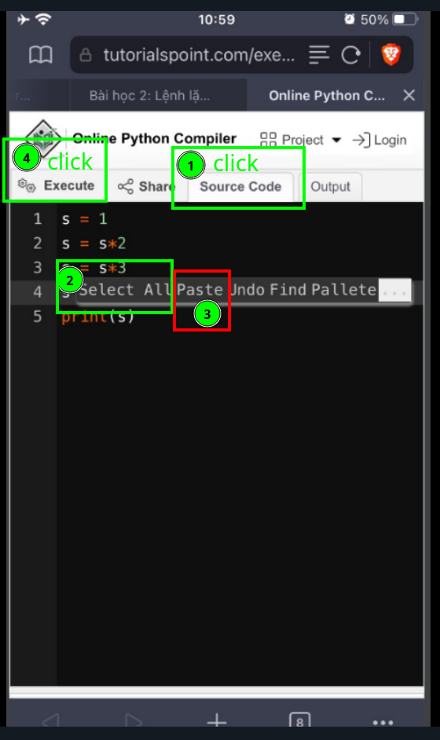

Bài học 2: Lệnh lặp `for`
---
---
[**Mục Lục**](../README.md)

Trong bài học này chúng ta luyện tập thao tác bấm **Execute** chạy trình
Để bắt đầu vào học các bạn nhấn vào Link sau.
[https://www.tutorialspoint.com/execute_python_online.php](https://www.tutorialspoint.com/execute_python_online.php)

Khi bấm như vậy thì facebook của các bạn sẽ bị ẩn đi mất, các bạn không thể vừa xem facebook vừa cho chạy trình. Muốn cùng lúc xem facebook và chạy trình thì các bạn bấm vào chỗ ... ở góc trên bên phải. Một bảng lựa chọn sẽ hiện ra. Các bạn bấm vào `Open In Browser`.


Như thế là các bạn đã mở trình dịch bằng `Browser`. Các bạn có thể lưu trang chạy trình này vào điện thoại (`Add To Home Screen`). Bây giờ các bạn có thể vừa sử dụng facebook và vừa chạy trình Python cùng lúc.


Các bạn đưa khúc lệnh sau vào **Source Code** và nhấn **Execute**:

```
s = 1
s = s*2
s = s*3
s = s*4
print(s)
```



Các bạn sẽ thấy kết quả là **24**. Đó chính là tích của các số từ 1 tới 4.
Chúng ta có thể hình dung quá trình tính toán như sau:
-  Đầu tiên chúng ta có một ô nhớ với tên gọi là s. Chúng ta ghi vào đó giá trị 1.
-  Lệnh tiếp theo chúng ta lấy giá trị của s nhân với 2 và lại ghi vào ô nhớ đó.
-  Lệnh tiếp theo chúng ta lấy giá trị của s nhân với 3 và lại ghi vào ô nhớ đó.
-  Lệnh tiếp theo chúng ta lấy giá trị của s nhân với 4 và lại ghi vào ô nhớ đó.
-  Và lệnh cuối cùng là in giá trị ra.

---
Nếu muốn tính tích của tất cả các số nguyên từ 1 tới 100 thì chúng ta cũng làm tương tự. Tuy nhiên việc phải viết tới 100 lần phép nhân s với một số tăng dần thì quá mệt, vì thế người ta đưa ra cú pháp như sau:
```
s = 1
for k in range(1,101):
   s = s*k # viết thụt vào
print(f'100! = {s}')
```

- Trong cú pháp này giá trị k sẽ tăng dần từ 1 tới 100 và mỗi lần giá trị trong ô `s` lại được nhân thêm với `k`. Lệnh như thế được gọi là lặp.
- Lệnh lặp `for` bao gồm khoảng chạy lặp, ở đây là `k in range(1,101)`.
- Tiếp theo là các lệnh cần phải lặp, ở đây là `s=s*k`. Nhớ là các lệnh này phải thụt vào một tí.
- Nhấn **Execute** các bạn sẽ có được giá trị của `100!` là
**93326215443944152681699238856266700490715968264381621468592963895217599993229915608941463976156518286253697920827223758251185210916864000000000000000000000000**

---
Chúng ta có thể thay 100 bằng 1000, điện thoại của các bạn sẽ tính ra được `1000!` trong nháy mắt
```
s = 1
for k in range(1,1001):
  s = s*k # viết thụt vào
print(f'1000! = {s}')
```

---
Các bạn có thể viết nó ở dạng đẹp hơn như sau
```
n = 1000
s = 1
for k in range(1,n+1):
  s = s*k # viết thụt vào
print(f'{n}! = {s}')
```
Các bạn cho biết `10000!` có bao nhiêu số  0 ở cuối nhé. (Đừng cho chạy tính giai thừa số lớn hơn nữa mà không thể chờ được. Nếu điện thoại bị treo thì thoát ra khỏi của sổ chạy trình và làm lại.)

---
Chúng ta cũng có thể tính tổng của các số nguyên từ 1 tới một số nào đấy:
```
n = 1000
s = 0
for k in range(1,n+1):
  s = s+k # viết thụt vào
print(f'Tổng các số từ 1 tới {n} là {s}')
```

---
Cũng có thể tính tổng bình phương các số nguyên từ 1 tới 1000:
```
n = 1000
s = 0
for k in range(1,n+1):
  s = s+k*k # viết thụt vào
print(f' Tổng bình phương các số từ 1 tới {n} là {s}')
```

---
Cũng có thể tính cùng lúc cả tổng lẫn tổng bình phương:
```
n = 1000
s = 0
p = 0
for k in range(1,n+1):
  s = s+k*k # viết thụt vào
  p = p+k*k*k # viết thụt vào
print(f' Các số nguyên từ 1 tới {n} có tổng bình phương là {s}, tổng lập phương là {p}')
```

---
Chúng ta có thể lấy tổng các số lẻ liên tiếp:
```
n = 5
s = 0
for k in range(0,n+1):
  s = s+(2*k+1) # viết thụt vào
print(f' các số nguyên lẻ từ 1 tới {2*n+1} là {s}')
```

Các bạn sẽ nhận ra tổng liên tiếp các số lẻ từ 1 luôn là một số chính phương (là bình phương của một số nguyên).

---
Trong khi đưa lệnh vào máy, các bạn lưu ý có sự khác nhau giữa việc **viết thụt vào** và **viết ngay đầu dòng**. Các lệnh (con) cùng nằm chung trong một lệnh thì phải **viết thụt vào**.

Nếu các bạn không thể chạy được trình thì báo ngay nhé.

Để cho các bạn dễ copy chúng ta để trình vào các còm.
Các bạn không cần phải vội đâu, chúng ta sẽ nhanh chóng có được kiến thức tốt nhất.

Để tôi có thể theo dõi khả năng chạy trình thành công của các bạn, xin các bạn tương tác LIKE vào tút này.


[**Bài trước đó**](1.md)

[**Bài tiếp theo**](3.md)