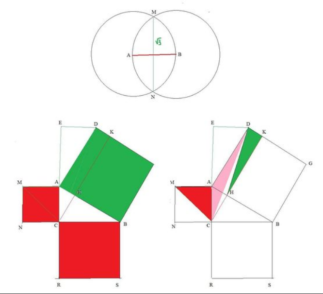

Định Lý Pitago.
---
---
[**Mục Lục**](../README.md)

Hình vẽ dưới đây là tam giác vuông ABC có đường huyền AB và hai cạnh góc vuông là CA và CB.



Trên mỗi cạnh người ta dựng một hình vuông. Diện tích của hình vuông thì bằng bình phương của cạnh.

Định lý Pitago nói rằng *tổng bình phương của hai cạnh bên bằng với bình phương của cạnh huyền.*

Như thế tổng diện tích của hai hình vuông màu đỏ bằng với diện tích của hình vuông màu xanh.

---
Chứng minh định lý thì không khó. Các điểm cho trên hình vẽ, trong đó `H` là chân đường cao hạ xuống cạnh huyền. Do cùng đáy và có chiều cao bằng nhau mà diện tích của hình `tam giác màu đỏ` thì bằng với diện tích hình `tam giác màu hồng`.

Đến lượt mình diện tích của `tam giác màu hồng` bằng với diện tích của `tam giác màu xanh`. Diện tích của hình vuông `MNCA` thì gấp 2 lần diện tích của `tam giác đỏ` và diện tích của hình chữ nhật `ADKH` thì gấp đôi diện tích của `tam giác xanh`.

Như thế diện tích của hình vuông `MNCA` bằng với diện tích của hình chữ nhật `AHKD`. Từ đây suy ra tổng diện tích của `hai hình vuông màu đỏ` bằng với diện tích của `hình vuông màu xanh`, hay là tổng bình phương của hai cạnh bên bằng với bình phương của cạnh huyền.

Xét đoạn thẳng đơn vị AB. Sử dụng compa vẽ hai vòng tròn đơn vị tâm tại A và B. Chúng cắt nhau tại M và N.

Sử dụng định lý Pitago chúng ta tính được bình phương chiều cao của tam giác đều `ABM` là 3/4. Như thế đoạn thẳng nối MN có độ dài là √3. Chúng ta đã quá quen với ký hiệu √3 mà chưa bao giờ tự hỏi "*√3 là gì?".*

### Vậy thì √3 là gì? Nó có phải là một số không?

Trước khi trả lời câu hỏi "√3 có phải là một số không?" chúng ta cần phải đưa ra định nghĩa số là gì?

Trước hết chúng ta cùng nhau ước lượng xem giá trị của √3 bằng bao nhiêu.

Các bạn vào link này và thực hiện phép toán
[https://www.tutorialspoint.com/execute_python_online.php](https://www.tutorialspoint.com/execute_python_online.php)
```
a = 1
print (a*a)
```

Kết quả cho là 1. Do `1*1 < 3` nên `1 < √3`

Chúng ta tiếp tục nâng dần:
```
a = 1.1
print (a*a)
```
Kết quả cho là 1.21. Do `1.21 < 3` nên `1.1 < √3`

---
Chúng ta nâng dần:
```
a = 1.2
print (a*a)
```
Kết quả cho là 1.44. Do `1.44 < 3` nên `1.2 < √3`

---
Cứ như thế chúng ta đi tới:
```
a = 1.7
print (a*a)
```
Kết quả cho là 2.89. Do `2.89 < 3` nên `1.7 < √3`

----
Rồi tới:
```
a=1.8
print (a*a)
```
Kết quả cho là 3.24. Do `3 < 3.24` nên `1.7 < √3 < 1.8`

---
Chúng ta có thể tiếp tục như vậy để nhận thấy:
```
173 * 173 = 29929
174 * 174 = 30276
1.73 < √3 < 1.74
```

Hãy cho em bé tiếp tục quá trình nhân và viết chúng ra giấy để thấy
`1.73205 < √3 < 1.73206`

Hãy nói với trẻ số √3 nằm ở giữa các số lớn hơn và nhỏ hơn và luôn có thể xác định được với mọi độ chính xác
```
1.7 < 1.73 < 1.73205 <... √3 ...< 1.73206 < 1.74 < 1.8
```

Chúng ta hình dung số thực là giao của các đoạn thẳng lồng nhau có độ dài tiến dần tới 0.
`[1.7 , 1.8] ⊃ [1.73 , 1.74] ⊃ [1.73205,1.73206] ...`

Hãy nói với trẻ một số là được sinh ra từ dãy các chữ số thập phân vô hạn mà có thể xác định được các chữ số ấy (với độ chính xác tùy ý, nó lớn hơn một số nào đó và nhỏ hơn một số nào đó).

---
**Điều quan trọng là phải để cho trẻ hình dung ra được toàn bộ quá trình tính các chữ số thập phân.**

Bằng cách thử như chúng ta nói ở trên có thể tính ra một số lượng chữ số thập phân của số √3.

Các bạn hãy cho trẻ làm tương tự cho √2 và √5. Hãy chạy mẩu trình sau để có được 5000 chữ số thập phân sau dấu phảy của √3.
```
from decimal import Decimal, getcontext
import math

getcontext().prec = 5001 # để lấy độ chính xác đến 5000 chữ số thập phân
num = Decimal(3)

print("√3 = {0}".format(num.sqrt()))
```

---
Hãy chạy mẩu trình sau để có được 10,000 chữ số thập phân sau dấu phảy của √2.
```
from decimal import Decimal, getcontext
import math
getcontext().prec = 10001 # để lấy độ chính xác đến 10,000 chữ số thập phân
num = Decimal(2)
print("√2 = {0}".format(num.sqrt()))
```

Các bạn kiểm tra lại giá trị căn:
```
from decimal import Decimal, getcontext
import math

getcontext().prec = 10001
num = Decimal(2)

print("√2 = {0}".format(num.sqrt()))

a = num.sqrt()
print("2 = {0}".format(a*a))
```

[**Bài trước đó**](3.md)

[**Bài tiếp theo**](5.md)